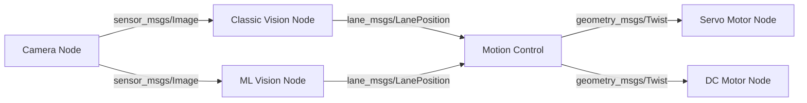

# SEA:ME ADS Project - Autonomous Driving System

## Overview
This project focuses on the development of an **Autonomous Driving System (ADS)** capable of detecting lanes and steering accordingly.

Utilizing **ROS 2**, a **Jetson Nano**, and a **Raspberry Pi**, we designed a system that integrates **computer vision and machine learning** to detect lanes, calculate optimal paths, and execute autonomous steering. The system leverage GPU accelerated computations the jetson nano make possible to significantly reduce computation time.

This project showcases the integration of **AI, embedded systems, and robotics** in the development of autonomous driving systems.

## Project Scope
This project aims to bridge the gap between **simulation-based** testing and **real-world autonomous driving** by designing and deploying an AI-driven lane detection and control system. The system utilizes:

- **ROS 2 Nodes** for real-time data processing and vehicle control.
- **Computer Vision (OpenCV)** for basic lane detection.
- **Machine Learning (PyTorch/TensorFlow)** for advanced lane detection.
- **Polynomial fitting & trajectory estimation** for path planning.
- **Carla sim** for software in the loop testing.

## System Architecture
The system consists of multiple ROS 2 nodes handling different tasks (see [here](https://github.com/Axel-ex/SEAME-ADS-Autonomous-lane-detection-24-25/tree/ml_vision/lane_keeping_ws) for more detail on system architecture):

1. **OpenCv-based Lane Prediction Node**
   - Processes camera feed using **OpenCV**.
   - Detects lane markings and extracts lane position.

2. **ML-based Lane Prediction Node**
   - Uses a **machine learning model** to enhance lane detection accuracy.
   - Runs inference on the **Jetson Nano** using optimized models.

3. **Path Planning & Control Node**
   - Fits lane lines using polynomial regression.
   - Calculates the lane center and determines the steering angle.

4. **Visualization Node**
   - Displays processed data and system state.



## Hardware Setup
- **Jetson Nano**: Runs the core AI model and ROS 2 nodes for lane detection and control.
- **Raspberry Pi**: Handles additional processing and system integration.
- **Camera Module**: Captures real-time road images for lane detection.
- **Motor Controller**: Executes the steering and movement commands.

## Key Features
- **Hybrid Lane Detection**: Combines traditional computer vision with ML-based approaches.
- **Real-time Processing**: Optimized to run efficiently on Jetson Nano (CUDA acceleration).
- **ROS 2 Integration**: Modular and scalable for future improvements.
- **Simulation / Reality testing**: Tested in both virtual (Carla) and real-world environments.

## Getting Started
### Prerequisites
Ensure you have the following installed:
- **ROS 2 (Foxy)**
- **OpenCV with CUDA support**
- **PyTorch or TensorFlow**
- **Colcon** for building ROS 2 packages

### Installation & Setup
Clone the repository and build the workspace:
```bash
git clone git@github.com:Axel-ex/SEAME-ADS-Autonomous-lane-detection-24-25.git
cd SEAME-ADS-Autonomous-lane-detection-24-25/lane_keeping_ws
colcon build --symlink-install 
source install/setup.bash
```
Run the nodes:
```bash
ros2 run launch launch/JetsonLaunch.py
```

## References
- [OpenCV](https://www.opencv-srf.com/2017/11/opencv-cpp-api.html)
- [ROS 2](https://docs.ros.org/en/foxy/Installation.html)
- [TensorFlow](https://www.tensorflow.org/)

